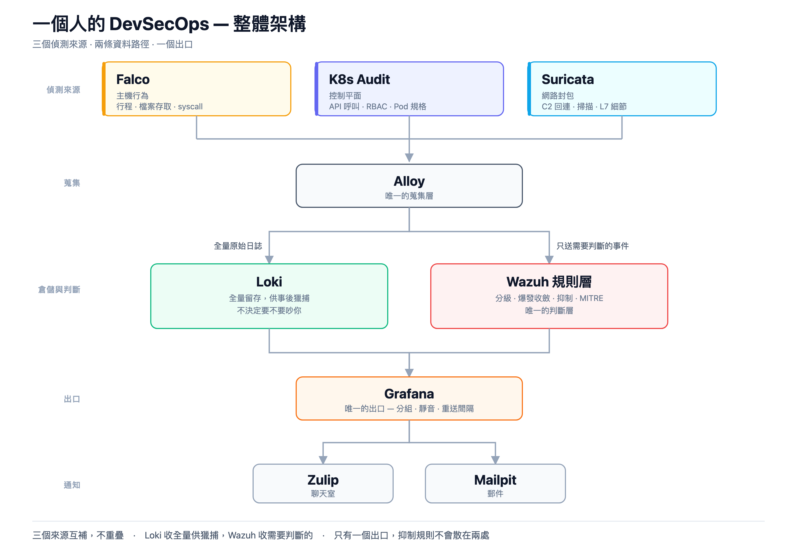

# solo-devsecops

**一個人的 DevSecOps** —— 在一台筆電上，用 kind 搭出一套完整的 Kubernetes
偵測與告警鏈，並且把每一個接點的理由寫清楚。

「一個人」不是修飾語，是整套東西的設計前提。**它不是企業級 SOC 的縮小版** ——
企業級的那套預設有人輪值、有人調規則、有人在告警進來的時候看一眼。這裡沒有，
所以每個決定都要先過一關：這個東西，一個人維護得下去嗎？

那個前提決定了很多取捨：

- 噪音要在**規則層治本**，而不是把門檻調高藏起來 —— 藏起來的噪音仍然在吃儲存與運算
- 告警要收斂成「**事件**」，不是逐筆轟炸 —— 一個被洗版的頻道等於一個被靜音的頻道
- 所有設定都進 Git，**重建環境不必記得自己在 UI 上點過什麼**

不是「照著貼就會動」的教學，是「為什麼要這樣接、不這樣接會怎樣」的紀錄。



## 這套東西在做什麼

三個偵測來源互補，不重疊：

| 來源 | 看得到 | 看不到 |
|---|---|---|
| **Falco** | 行程、檔案存取、syscall、容器內開 shell | 網路上發生什麼事 |
| **K8s Audit** | 誰呼叫了 API、RBAC 變更、Pod 規格 | 容器裡實際做了什麼 |
| **Suricata** | 封包內容、C2 回連、掃描、L7 細節 | 主機上的行為 |

兩條資料路徑分工清楚：**Loki 收全量供事後獵捕，Wazuh 只收需要判斷的事件。**
Wazuh 的規則層負責分級、爆發收斂、抑制與 MITRE ATT&CK 對應，
再由 Grafana 這個唯一的出口送往 Zulip 與 Mailpit。

整套約 **1150m CPU / 2.6 GiB**，跑在單機 kind 上。

## 幾個實測數字

這些是過程中量出來的，不是估算：

| 項目 | 數字 |
|---|---|
| Prometheus target | 補上 `toEntities: [host, remote-node]` 前後：`15/29 → 39/39` |
| Falco 的 OCI artifact | 直連 ghcr.io `148 秒` → 本機 mirror 快取命中 `0.008 秒` |
| Suricata 的 eve.json | `1.2 GB/天/node`，其中 alert 只佔 `0.75%` |
| Suricata 的 alert | 初始有 `70%` 是環境造成的協定異常，ET Open 真實命中 `0 筆` |
| Falco 告警 | 每分鐘約 `300 則`，其中 `87%` 是健康探針 |
| Wazuh 爆發收斂 | 同一次攻擊：逐筆 `133 則` → 收斂後 `1 則` |

## 文章

完整的八篇在 [`articles/`](articles/)：

| # | 篇名 | 主題 |
|---|---|---|
| 1 | [先畫地圖，再動手](articles/01-overview.md) | 架構心智模型、單機 kind 的資源陷阱 |
| 2 | [零信任的地基](articles/02-zero-trust-network.md) | Cilium CCNP、default deny、四個不報錯的坑 |
| 3 | [看得見才管得住](articles/03-observability.md) | Alloy / Loki / Prometheus / Grafana Operator |
| 4 | [主機層偵測](articles/04-falco-operator.md) | falco-operator、規則遮蔽、OCI mirror |
| 5 | [控制平面偵測](articles/05-k8s-audit.md) | 稽核政策、17 條規則不觸發的四個根因 |
| 6 | [網路層偵測](articles/06-suricata.md) | Suricata chart、先量再調 |
| 7 | [從事件到告警](articles/07-wazuh-brain.md) | Wazuh 規則層、爆發收斂 |
| 8 | [最後一哩與告警疲勞](articles/08-alerting-and-fatigue.md) | Grafana alerting、噪音治理、總結 |

## 目錄結構

```
articles/      八篇文章與架構圖（images/render.sh 可重新輸出 PNG）
bootstrap.md   完整的部署步驟，依相依順序排列
kind/          叢集設定、稽核政策、稽核 webhook
manifests/
  ccnp/          Cilium 叢集層網路策略，檔名編號即套用順序
  falco-operator/ Falco 的五個 CR 與 k8saudit webhook Service
  grafana-operator/ 資料來源、儀表板、告警規則、通知政策
  coredns/       讓 Pod 解析得到本機 OCI mirror
  alloy/         Falco → Wazuh 的 syslog 管線（附完整註解）
values/        各 Helm chart 的 values，含 Falco 與 Wazuh 的自訂規則
charts/
  suricata/      自建的 Suricata chart（規則打進 image，附驗證腳本）
  mailpit/       本機 SMTP 收件匣
registry/      ghcr.io 的 pull-through 快取
scripts/       Zulip 整合用的小工具
```

## 快速開始

> ⚠️ 這是實驗環境，不要直接用在正式叢集。所有密碼、憑證、網段都是本機用的。

需要：`docker`（**至少 10 CPU / 16 GiB**）、`kind`、`kubectl`、`helm`、`yq`、`jq`

```shell
# 1. 準備機敏設定（兩份都在 .gitignore 裡，不會進版控）
cp manifests/credentials.env.example manifests/credentials.env
cp manifests/seaweedfs/s3.config.example manifests/seaweedfs/s3.config
# 編輯這兩份，填入自己的帳密與金鑰

# 2. 建立叢集
kind create cluster --config kind/config.yaml

# 3. 其餘步驟照 bootstrap.md 由上而下執行
```

`bootstrap.md` 的順序有相依性，**不要跳著做**。兩條最重要的：

- **網路策略先於應用部署。** 倒過來做的話，每裝一個元件就要回頭 debug 一次。
- **告警鏈最後才接。** 在規則調好之前接上通知，只會得到一個被靜音的頻道。

## 它的極限

誠實講清楚這套東西做不到什麼：

- **沒有真人輪值。** 告警送到聊天室之後就沒有人了。這不是技術問題。
- **威脅情報是靜態的。** Wazuh 內建的 `mitre.db` 止於 2023-05，ET Open 要手動更新。
- **視野有洞。** Cilium native routing 下，同節點的 Pod 互連不經過 `eth0`，
  Suricata 看不到。測規則一定要跨節點。
- **規則調校沒有做完的一天。** 每裝一個新元件就會多一批噪音。

但它能做到最重要的一件事：**當某件事發生時，你有地方可以查，而且查得到。**

## 授權

[MIT](LICENSE)。

這個授權涵蓋本 repo 自己寫的設定、chart 與文章。各元件（Cilium、Falco、
Suricata、Wazuh、Grafana…）與它們的規則集（例如 ET Open）各有自己的授權，
使用前請自行確認。

## 說明

- 設定裡的 `the-one.k8s`、`harbor.example.com`、`192.168.247.x` 都是本機的值，
  換到你的環境要一併調整。第 5 篇列了命名空間寫死的五個位置。
- `values/` 裡的 Helm chart 版本都有釘住。上游改版後行為可能不同，
  文章裡的輸出以當時的版本為準。
- 歡迎指出寫錯的地方。這個領域一個人走得慢，一起走才走得遠。
