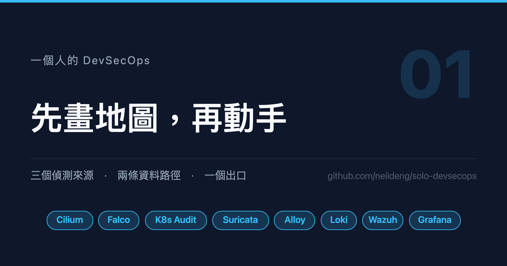

# 一個人的 DevSecOps (1)：先畫地圖，再動手

三個偵測來源、兩條資料路徑、一個出口。以及單機 kind 上那個會騙過 scheduler 的資源陷阱。



## 背景說明

「DevSecOps」這個詞在招募啟事上看起來像一個職位，在實作上卻是一整排工具。
網路上多數文章教的是「怎麼裝 Falco」「怎麼裝 Wazuh」，裝完之後各自亮著綠燈，
但它們之間要怎麼接、誰該負責判斷、哪些訊號該吵醒你 —— 這部分往往沒有人寫。

本系列要做的事是：**在一台筆電上，用 kind 搭出一套完整的偵測與告警鏈，
並且把每一個接點的理由寫清楚。** 不是「照著貼就會動」的教學，而是
「為什麼要這樣接、不這樣接會怎樣」的紀錄。

目標讀者是已經會用 Kubernetes、想往安全這個方向走的工程師。你不需要有
SOC 經驗，但需要願意在每一步停下來問一句「這個訊號到底從哪裡來」。

完成之後你會有：三個互補的偵測來源、一條收斂過的告警鏈、兩個可以查的
資料倉儲，以及一份自己踩過坑所以記得住的地圖。

## 環境必須

1. 事先安裝好指令集：`docker`、`kind`、`kubectl`、`helm`、`yq`、`jq`
2. Docker Desktop 或 OrbStack，至少配置 **10 CPU / 16 GiB**
3. 一台能連外的機器（第一次要拉不少 image）

## 1. 先看地圖

整套系統只有兩個方向的資料流，但很容易在裝到第五個工具時忘記自己在幹嘛。
先記住這張圖：


三句話說完這張圖：

- **三個來源互補，不重疊。** 它們看的是三件不同的事。
- **Loki 收全量，Wazuh 收需要判斷的。** 前者供事後獵捕，後者決定要不要吵你。
- **只有一個出口。** 分組、抑制、重送間隔都在同一個地方設。

## 2. 為什麼是這三個來源

這是整個系列最重要的一節。如果只讀一段，讀這段。

| 來源 | 看得到 | 看不到 |
|---|---|---|
| Falco | 行程、檔案存取、syscall、容器內開 shell | 網路上發生什麼事 |
| K8s Audit | 誰呼叫了 API、RBAC 變更、Pod 規格 | 容器裡實際做了什麼 |
| Suricata | 封包內容、C2 回連、掃描、L7 細節 | 主機上的行為 |

三者的盲點彼此互補，這不是巧合，是**分層的必然**：一次入侵會在不同的層
留下不同的痕跡，只看一層就只能看到故事的一段。

舉個本系列後面會真的撞到的例子：某個服務的 Basic Auth 憑證在叢集內以
明文 HTTP 傳輸。

- 從瀏覽器看：網址列是 `https`，完全正常
- Falco 看不到：那是網路上的事，不是主機上的事
- Hubble 看得到連線存在，但看不到 header 裡有 `Authorization: Basic`
- **只有 Suricata 看得到**

反過來說，有人在容器裡 `kubectl exec` 進去開一個 shell，Suricata 看到的
只是一條加密連線，Falco 卻會明確告訴你「某個 Pod 裡出現互動式 shell」。

> **補一個偵測來源的價值，不是多一個告警，是多一種別人看不到的視角。**

## 3. 先算資源，不然會被 scheduler 騙

這是我在第一天就踩到的坑，而且它騙得很徹底。

部署之前想先確認資源夠不夠，於是看了一眼節點：

```shell
kubectl get nodes -o custom-columns=NAME:.metadata.name,CPU:.status.capacity.cpu,MEM:.status.capacity.memory
```

畫面會輸出：

```
NAME                    CPU   MEM
the-one-control-plane   10    16116604Ki
the-one-worker          10    16116604Ki
the-one-worker2         10    16116604Ki
the-one-worker3         10    16116604Ki
```

看起來有 40 CPU / 64 GiB，於是放心地用了某個 chart 的預設值
（3700m CPU / 5.2 GiB）。結果 Pod 一直 `Pending`。

再看一眼 Docker：

```shell
docker info --format '{{.NCPU}} CPU / {{.MemTotal}} bytes'
```

畫面會輸出：

```
10 CPU / 16819609600 bytes
```

**kind 的四個節點是同一個 Docker VM 裡的四個容器，那是同一份資源被數了四次。**

這個陷阱在單機 kind 上特別危險，因為 scheduler 會照「每節點 10 核」去排程，
它不知道四個節點共用一份 CPU。**你會看到 Pod 成功排程、然後整台機器一起慢下來**，
而不是乾脆的 `Insufficient cpu`。

所以本系列所有元件都刻意縮編過：

| 元件 | chart 預設 | 本系列 |
|---|---|---|
| Wazuh indexer | 3 副本 | 1 副本 |
| Wazuh worker | 2 副本 | 1 副本 |
| JVM heap | 預設 | 768m |
| PVC | 50Gi | 10Gi |

縮編後整套約 1150m CPU / 2.6 GiB，留得下空間給被監控的工作負載。

## 4. 建立叢集

`kind` 的設定檔有兩個與後面章節直接相關的地方，先放進去，免得之後重建：

```yaml
# kind/cluster.yaml
kind: Cluster
apiVersion: kind.x-k8s.io/v1alpha4
name: the-one
networking:
  # 由 Cilium 接手，不要讓 kindnet 先上
  disableDefaultCNI: true
  kubeProxyMode: none
nodes:
  - role: control-plane
    kubeadmConfigPatches:
      - |
        kind: ClusterConfiguration
        apiServer:
          extraArgs:
            # 稽核日誌。第 5 篇會用到，先開著
            audit-policy-file: /etc/kubernetes/policies/audit-policy.yaml
            audit-webhook-config-file: /etc/kubernetes/policies/audit-webhook.yaml
    extraMounts:
      - hostPath: ./kind/audit-policy.yaml
        containerPath: /etc/kubernetes/policies/audit-policy.yaml
        readOnly: true
  - role: worker
  - role: worker
  - role: worker
```

兩個選擇值得說明：

**`disableDefaultCNI: true`。** 第 2 篇整篇都在講 Cilium 的
`CiliumClusterwideNetworkPolicy`，那是 kindnet 沒有的能力。而且
`kubeProxyMode: none` 讓 Cilium 接手 service 轉發，Hubble 才看得到
完整的連線脈絡。

**三個 worker。** 不是為了算力，是為了**讓流量跨節點**。這件事在第 6 篇
會變成關鍵：Cilium 的 native routing 下，同節點的 Pod 互連不經過 `eth0`，
Suricata 看不到。單節點叢集測 IDS 規則會得到「規則沒問題但一筆都沒觸發」
的假象。

建立：

```shell
kind create cluster --config kind/cluster.yaml
```

## 5. 整個系列的部署順序

順序不是隨便排的，有兩條相依鏈：

```
Cilium ──→ CCNP ──────────────────────┐
   │                                   │
   └─→ cert-manager ─→ step-ca ─→ Gateway
                                       │
                 SeaweedFS ─→ Loki ────┤
                 Prometheus ───────────┼─→ Grafana Operator
                 Alloy ────────────────┤
                                       │
                 Falco ────────────────┤
                 Suricata ─────────────┼─→ Wazuh ─→ Grafana Alerting
                 K8s Audit ────────────┘                │
                                                        ▼
                                                 Zulip / Mailpit
```

**網路策略要在應用之前先上。** 很多人（包括我）習慣最後才補 NetworkPolicy，
結果是每裝一個元件就要回頭debug一次「為什麼連不到」。先把 default deny 立起來、
再逐一放行，每個放行都有明確的理由，反而比較快。第 2 篇會示範這個順序。

**告警鏈要最後接。** 在偵測規則還沒調好之前就接上通知，只會得到一個被洗版的
聊天室，然後你會把它靜音 —— 那就前功盡棄了。第 8 篇會用實測數字說明這件事
有多容易發生。

## 小結

- **先畫地圖再動手**：三個偵測來源、兩條資料路徑、一個出口。裝到第五個工具時
  還記得自己在幹嘛，靠的是這張圖而不是記憶力。
- **三個來源互補不是冗餘**：主機、控制平面、網路，各自有對方看不到的盲點。
  判斷要不要再加一個來源，問的是「它能看到什麼別人看不到的」。
- **單機 kind 的資源要自己算**：`kubectl get nodes` 會把同一份記憶體報成四份，
  而 scheduler 照著那個假數字排程，症狀是整台機器變慢而不是排程失敗。

下一篇開始動手，從最底層的網路策略開始。

<!-- series:start -->
系列文：

- **一個人的 DevSecOps (1)：先畫地圖，再動手（本篇）**
- [一個人的 DevSecOps (2)：零信任的地基](02-zero-trust-network.md)
- [一個人的 DevSecOps (3)：看得見才管得住](03-observability.md)
- [一個人的 DevSecOps (4)：主機層偵測](04-falco-operator.md)
- [一個人的 DevSecOps (5)：控制平面偵測](05-k8s-audit.md)
- [一個人的 DevSecOps (6)：網路層偵測](06-suricata.md)
- [一個人的 DevSecOps (7)：從事件到告警](07-wazuh-brain.md)
- [一個人的 DevSecOps (8)：最後一哩與告警疲勞](08-alerting-and-fatigue.md)
<!-- series:end -->

想要知道更多，可參考以下資源：

- [Cilium](https://cilium.io/)
- [Falco](https://falco.org/)
- [Suricata](https://suricata.io/)
- [Wazuh](https://wazuh.com/)
- [MITRE ATT&CK for Containers](https://attack.mitre.org/matrices/enterprise/containers/)
