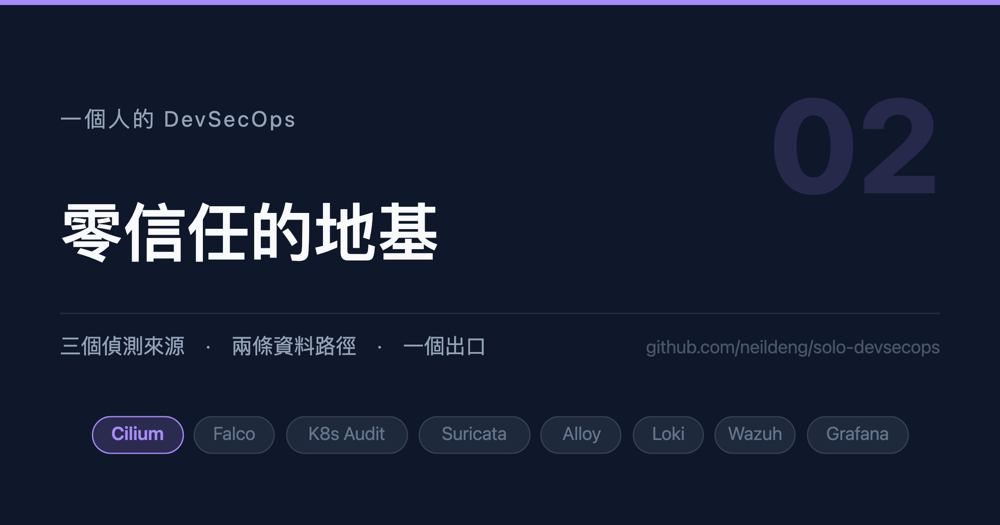

# 一個人的 DevSecOps (2)：零信任的地基



## 背景說明

上一篇畫完地圖，這一篇先把地基打好：**在任何應用進來之前，先讓叢集預設拒絕
所有流量。**

這個順序常被倒過來做。一般的習慣是先把東西裝起來、確認會動，最後再補
NetworkPolicy —— 結果是每補一條就要回頭查一次「為什麼它連不到了」，而且
你永遠不確定自己是不是補完了。

反過來做的成本其實更低：default deny 先立起來，之後每裝一個元件就補一條
放行，**而每一條放行都是你親手寫的、有理由的**。到最後你會有一份完整描述
「誰可以跟誰說話」的清單，那份清單本身就是資產。

本文用 Cilium 的 `CiliumClusterwideNetworkPolicy`（以下簡稱 CCNP），
並且會示範四個會讓策略**靜默失效**的坑 —— 它們的共同點是不會報錯。

## 環境必須

1. 已依第 1 篇建立好 kind 叢集（`disableDefaultCNI: true`）
2. `helm`、`kubectl`、`cilium` CLI（選用）

## 1. 安裝 Cilium

```shell
helm upgrade --install cilium -n kube-system \
  --repo https://helm.cilium.io cilium --version 1.20.2 \
  --set kubeProxyReplacement=true \
  --set k8sServiceHost=the-one-control-plane \
  --set k8sServicePort=6443 \
  --set hubble.relay.enabled=true \
  --set hubble.ui.enabled=true \
  --set gatewayAPI.enabled=true
```

等它起來：

```shell
kubectl -n kube-system rollout status ds/cilium
```

## 2. 為什麼不用 vanilla NetworkPolicy

標準的 `NetworkPolicy` 能做的事，本系列有一半做不到。下表是實際用到的
Cilium 專屬能力，以及它們各自解決什麼問題：

| 能力 | 解決的問題 |
|---|---|
| `egressDeny` | **顯式拒絕**，優先於所有 allow。即使日後有人寫了寬鬆放行也擋得住 |
| `toEntities: kube-apiserver` | 不必寫死 ClusterIP，HA 叢集下也不會漏 |
| `fromEntities: ingress` | Gateway 轉發進來的流量不屬於任何 Pod，選不到 |
| `fromEntities: host, remote-node` | 稽核 webhook 的來源是**節點**不是 Pod |
| `toFQDNs` | CDN 的 IP 會變，只能用網域名稱 |
| `enableDefaultDeny: false` | 讓放行策略可以先單獨上線，不會順手把端點推進 deny |

vanilla `NetworkPolicy` 只有 allow，沒有 deny。「預設拒絕」是靠「沒有任何
allow」間接達成的 —— 那表示**任何一條寬鬆的放行都能繞過你的所有設計**。
`egressDeny` 讓你可以畫出一條沒有人能跨過的紅線。

## 3. 編號即套用順序

目錄長這樣：

```
manifests/ccnp/
├── 10-infra-baseline.yaml      # DNS (含 L7 proxy)、API Server 雙向、Gateway 轉發
├── 20-deny-metadata-api.yaml   # 顯式拒絕雲端 metadata endpoint
├── 30-kube-security-egress.yaml
├── ...
└── 99-default-deny.yaml        # 全叢集 default deny
```

**放行先上、`default-deny` 最後**，所以整個目錄一起套用是安全的：

```shell
kubectl apply -f manifests/ccnp/
```

十位數編號留了插入空間，新增應用層策略從 70 開始。

這個約定看起來很小，但它讓「重建環境」這件事從一連串需要記憶的步驟
變成一行指令。一個人維運的時候，**能寫進檔名的約定就不要寫進腦袋**。

## 4. 第一個坑：`NotIn` 在標籤不存在時也成立

先看 default deny 本身。直覺的寫法是選中所有 endpoint：

```yaml
endpointSelector: {}
```

這會讓叢集當場癱瘓 —— CoreDNS、Cilium 自己、API Server proxy 全被擋。
所以要排除系統 namespace：

```yaml
endpointSelector:
  matchExpressions:
    - key: k8s:io.kubernetes.pod.namespace
      operator: NotIn
      values: [kube-system, kube-public, kube-node-lease]
```

看起來很合理，但**這樣寫是錯的**。

Kubernetes 的 `NotIn` 在「標籤不存在」時也成立。Cilium 有一組保留 endpoint
沒有 namespace 標籤：

| 保留 endpoint | 被擋的後果 |
|---|---|
| `reserved:health` | 節點間健康檢查失效 |
| `reserved:ingress` | Gateway / Ingress 流量被擋 |
| `reserved:init` | Pod 初始化期間網路被擋 → **偶發的啟動失敗** |

最後那個最難查：它不是每次都發生，而且錯誤訊息完全看不出跟網路策略有關。

正確寫法是 `Exists` 與 `NotIn` 並用：

```yaml
apiVersion: cilium.io/v2
kind: CiliumClusterwideNetworkPolicy
metadata:
  name: ccnp-default-deny
spec:
  description: "Deny all ingress and egress except system namespaces"
  endpointSelector:
    matchExpressions:
      # 這條不能省，理由見上
      - key: k8s:io.kubernetes.pod.namespace
        operator: Exists
      - key: k8s:io.kubernetes.pod.namespace
        operator: NotIn
        values:
          - kube-system
          - kube-public
          - kube-node-lease
          - cilium-secrets
          - local-path-storage
  # 顯式寫出來，不依賴「空 rule」的隱含語意 ——
  # 有人整理 YAML 時刪掉 `- {}`，整條策略會靜默失效
  enableDefaultDeny:
    ingress: true
    egress: true
  ingress:
    - {}
  egress:
    - {}
```

兩個方向都給空的允許清單，就等於全拒。

## 5. 第二個坑：`egressDeny` 會觸發 default deny

接著畫紅線。雲端的 metadata endpoint（`169.254.169.254`）是 SSRF 攻擊的
經典目標，對應 MITRE 的 T1190。這條在 vanilla NetworkPolicy 裡做不到：

```yaml
apiVersion: cilium.io/v2
kind: CiliumClusterwideNetworkPolicy
metadata:
  name: ccnp-deny-metadata-api
spec:
  description: "Block access to cloud metadata endpoints"
  endpointSelector:
    matchExpressions:
      - key: k8s:io.kubernetes.pod.namespace
        operator: Exists
      - key: k8s:io.kubernetes.pod.namespace
        operator: NotIn
        values: [kube-system]
  # 這兩行不能省，理由見下
  enableDefaultDeny:
    ingress: false
    egress: false
  egressDeny:
    - toCIDR:
        - 169.254.169.254/32
        - 169.254.170.2/32   # ECS task metadata
```

`enableDefaultDeny` 那兩行是第二個坑。依 CRD 的定義，**「某方向有規則時，
該方向的 default deny 預設為 true」**，而 `egressDeny` 算 egress 方向的規則。

也就是說：一條純粹的「拒絕」策略，如果不明確把 default deny 關掉，
會順帶把**被它選中的所有端點**推進 egress default-deny。你以為只擋了一個
IP，實際上擋掉了全部。

這條策略在整個架構裡的角色也值得一提：**偵測與預防的分工。**
Falco 會在有人嘗試連 metadata API 時告訴你（看見），這條 CCNP 讓他連不上
（擋住）。兩者都要有 —— 只有偵測你會來不及，只有預防你不知道有人在試。

## 6. 第三個坑：L4 的 DNS 放行會壓過 L7

`toFQDNs` 是很好用的能力：你可以寫「允許連到 `ghcr.io`」而不必追著 CDN 的
IP 跑。它的運作方式是 Cilium 攔截 DNS 查詢、記下回應的 IP，再據此放行。

前提是 **DNS 必須走 Cilium 的 L7 proxy**。而這裡有個陷阱：

> 同一段流量同時有 L4-only 與 L7 放行時，Cilium 取**較寬鬆**者。

所以如果你在某個 namespace 的策略裡順手寫了一條「允許 UDP/53 到 CoreDNS」，
那段 DNS 就繞過 proxy 了，`toFQDNs` 永遠學不到 IP，結果是出網規則全部失效 ——
**而且沒有任何錯誤訊息**，你只會看到 `i/o timeout`。

解法是約定：**DNS 只在 `10-infra-baseline.yaml` 宣告一次，別處不准再寫。**

```yaml
  egress:
    - toEndpoints:
        - matchLabels:
            k8s:io.kubernetes.pod.namespace: kube-system
            k8s:k8s-app: kube-dns
      toPorts:
        - ports:
            - port: "53"
              protocol: ANY
          rules:
            dns:
              - matchPattern: "*"
```

## 7. 第四個坑：Gateway 這一跳在策略上是透明的

這個坑花掉我最多時間。

場景：某個 Pod 要連到另一個服務，中間走 Cilium Gateway。直覺是「放行到
Gateway 就好」，但實際上怎麼寫都不通。實測過的無效寫法：

- `toEntities: ingress`
- `toServices` 指向 Gateway 的 Service
- `toCIDR` 哨兵位址（`192.192.192.192`）

原因是 **Cilium Gateway 代替客戶端執行「客戶端 → 後端」的策略檢查**。
在策略的眼中，那一跳不存在；要放行的是**真正的目的地**。

結論很簡潔：**走 Gateway 省不掉任何策略。** 既然如此，內部通訊就直接指向
Service，不必繞 Gateway。

## 8. 一條連線要放行兩次

最後一個觀念，它不是坑，是設計上的必然，但初期很容易漏。

default deny 同時擋進與出，所以**每條連線都要在兩個地方各放行一次**：

```
來源端的 egress  ─→  目的端的 ingress
```

只寫一邊的症狀跟完全沒寫一樣 —— `i/o timeout`，而且看不出少了哪半邊。

所以本系列裡凡是跨 namespace 的連線，策略都是成對出現的。例如 Loki 要存取
SeaweedFS 的 S3 介面：

```yaml
---
# 來源端：Loki 可以連出去
apiVersion: cilium.io/v2
kind: CiliumClusterwideNetworkPolicy
metadata:
  name: ccnp-loki-to-seaweedfs
spec:
  endpointSelector:
    matchLabels:
      k8s:io.kubernetes.pod.namespace: observability
      k8s:app.kubernetes.io/name: loki
  enableDefaultDeny: { ingress: false, egress: false }
  egress:
    - toEndpoints:
        - matchLabels:
            k8s:io.kubernetes.pod.namespace: seaweedfs
            k8s:app.kubernetes.io/component: s3
      toPorts:
        - ports: [{ port: "8333", protocol: TCP }]
---
# 目的端：SeaweedFS 接受 Loki 連入
apiVersion: cilium.io/v2
kind: CiliumClusterwideNetworkPolicy
metadata:
  name: ccnp-seaweedfs-from-loki
spec:
  endpointSelector:
    matchLabels:
      k8s:io.kubernetes.pod.namespace: seaweedfs
      k8s:app.kubernetes.io/component: s3
  enableDefaultDeny: { ingress: false, egress: false }
  ingress:
    - fromEndpoints:
        - matchLabels:
            k8s:io.kubernetes.pod.namespace: observability
            k8s:app.kubernetes.io/name: loki
```

寫起來囉嗦，但它強迫你每次都說清楚「誰連誰」，而這正是零信任的重點。

## 9. 驗證

套用之後，先確認策略有被接受：

```shell
kubectl get ccnp
```

接著做一次負面測試 —— 開一個不在任何放行清單裡的 Pod，確認它連不出去：

```shell
kubectl run netcheck --image=busybox:1.36 --restart=Never -n default \
  --command -- sh -c 'wget -T 3 -qO- http://example.com; echo "exit=$?"'
```

預期是逾時。如果它成功了，表示 default deny 沒生效 —— 多半是
`endpointSelector` 漏了 `Exists`，或是某條策略的 `enableDefaultDeny`
把方向關掉了。

最後，Hubble 是查策略問題最快的工具：

```shell
cilium hubble port-forward &
hubble observe --verdict DROPPED --last 50
```

它會直接告訴你哪一條流量被哪個方向擋掉。**查 CCNP 不要用 `kubectl logs`，
要用 Hubble。**

## 小結

- **網路策略要先於應用部署**：倒過來做的話，每裝一個元件就要回頭 debug 一次，
  而且永遠不確定補完了沒。先 deny 再逐條放行，最後會得到一份完整的
  「誰可以跟誰說話」清單。
- **四個坑的共同點是不報錯**：`NotIn` 少了 `Exists`、`egressDeny` 沒關
  default deny、L4 DNS 壓過 L7、Gateway 在策略上透明 —— 四個都是「設定存在、
  看起來正常、就是不會動」。查這類問題要用 Hubble 看 verdict，不要看日誌。
- **一條連線放行兩次**：來源端 egress 與目的端 ingress 缺一不可，只寫一邊的
  症狀與完全沒寫相同。

下一篇把可觀測性立起來 —— 在偵測工具進來之前，要先有地方放資料。

<!-- series:start -->
系列文：

- [一個人的 DevSecOps (1)：先畫地圖，再動手](01-overview.md)
- **一個人的 DevSecOps (2)：零信任的地基（本篇）**
- [一個人的 DevSecOps (3)：看得見才管得住](03-observability.md)
- [一個人的 DevSecOps (4)：主機層偵測](04-falco-operator.md)
- [一個人的 DevSecOps (5)：控制平面偵測](05-k8s-audit.md)
- [一個人的 DevSecOps (6)：網路層偵測](06-suricata.md)
- [一個人的 DevSecOps (7)：從事件到告警](07-wazuh-brain.md)
- [一個人的 DevSecOps (8)：最後一哩與告警疲勞](08-alerting-and-fatigue.md)
<!-- series:end -->

想要知道更多，可參考以下資源：

- [Cilium Network Policy](https://docs.cilium.io/en/stable/security/policy/)
- [CiliumClusterwideNetworkPolicy](https://docs.cilium.io/en/stable/network/kubernetes/policy/#ciliumclusterwidenetworkpolicy)
- [Hubble](https://docs.cilium.io/en/stable/observability/hubble/)
- [MITRE ATT&CK T1190](https://attack.mitre.org/techniques/T1190/)
