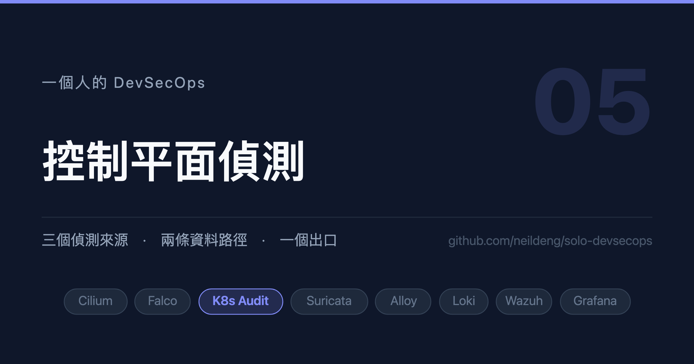

# 一個人的 DevSecOps (5)：控制平面偵測

17 條稽核規則一條都沒觸發。拆出四個獨立的根因，沒有一個會報錯。



## 背景說明

Falco 看得到容器裡執行了什麼行程，但看不到**誰呼叫了 Kubernetes API**。
有人建立了一個 `ClusterRoleBinding`、有人把某個 Pod 改成 privileged、
有人用 `kubectl exec` 進了容器 —— 這些都發生在控制平面，主機層看不到。

Kubernetes 的稽核日誌（audit log）補的就是這一塊。Falco 有 `k8saudit`
plugin 可以直接消費它，於是同一套規則引擎可以同時處理兩種來源。

本文的主軸是一次真實的追查：**我寫了 17 條 k8s_audit 規則，一條都沒觸發。**
最後拆出**四個獨立的根因**，沒有一個會報錯。

## 環境必須

1. 已完成第 4 篇（falco-operator + k8saudit plugin）
2. 能修改 kind 的叢集設定並重建（或能改 kube-apiserver 的 manifest）

## 1. 稽核鏈路

```
kube-apiserver ──(webhook)──→ Falco 的 k8saudit plugin ──→ 規則引擎
       │
       └── audit-policy.yaml 決定「哪些事件會被記錄」
```

兩端各要設定一次：

**API Server 端**（kind 的 `kubeadmConfigPatches`）：

```yaml
    kubeadmConfigPatches:
      - |
        kind: ClusterConfiguration
        apiServer:
          extraArgs:
            audit-policy-file: /etc/kubernetes/policies/audit-policy.yaml
            audit-webhook-config-file: /etc/kubernetes/policies/audit-webhook.yaml
            audit-webhook-batch-max-wait: 5s
```

**Falco 端**（`Plugin` CR）：

```yaml
apiVersion: artifact.falcosecurity.dev/v1alpha1
kind: Plugin
metadata:
  name: k8saudit
  namespace: kube-security
spec:
  ociArtifact: { ... }
  config:
    openParams: "http://:9765/k8s-audit"
```

加上一個 NodePort Service 讓 API Server 連得到。注意 **operator 的 `Falco` CR
沒有 service 欄位**，這支 Service 要自己維護：

```yaml
apiVersion: v1
kind: Service
metadata:
  name: falco-k8saudit-webhook
  namespace: kube-security
spec:
  type: NodePort
  # Local：webhook 要送到「本節點上的」falco，不要再跨節點轉發
  externalTrafficPolicy: Local
  selector:
    app.kubernetes.io/name: falco
  ports:
    - port: 9765
      targetPort: 9765
      nodePort: 30007
```

還有一條 CCNP —— 這是第 2 篇說過的「來源是節點不是 Pod」的案例：

```yaml
  ingress:
    - fromEntities:
        - host
        - remote-node
      toPorts:
        - ports: [{ port: "9765", protocol: TCP }]
```

## 2. 症狀：17 條規則，0 次觸發

鏈路接好之後，Falco 的 k8s_audit 規則一條都不觸發。

這類問題最難的地方在於：**規則在、條件對、就是沒有輸出。** 沒有錯誤訊息，
沒有拒絕，沒有任何可以 grep 的字串。

後來拆出四個獨立的根因，它們疊在一起，表面現象完全一樣。

## 3. 根因一：稽核政策沒記錄那個資源

稽核政策的規則**由上而下比對，第一條命中就決定 level**，而且 ——

> **沒有任何規則命中的事件不會被記錄。**

如果你的政策裡沒有 catch-all（本系列刻意不放，避免 audit log 爆量），
那麼任何沒被列舉到的資源，Falco 就永遠收不到它的事件。

原本的政策漏了 `serviceaccounts/token`、`daemonsets` 的刪除等等，所以
對應的規則註定不會觸發。

補上之後的政策長這樣（節錄）：

```yaml
apiVersion: audit.k8s.io/v1
kind: Policy
rules:
  # ---- 排除：高頻且無安全價值的端點 ----
  # 必須排在所有 pods 規則之前。kubelet 的狀態回報頻率極高，
  # 不排除的話 pods 的稽核量會被它淹沒。
  - level: None
    resources:
      - group: ""
        resources: [pods/status, pods/binding, pods/log]

  - level: None
    nonResourceURLs: ["/healthz*", "/readyz*", "/livez*", "/version", "/metrics"]

  # ---- Pod 建立與刪除 ----
  - level: RequestResponse
    resources:
      - group: ""
        resources: ["pods"]
    verbs: ["create", "delete"]

  # ---- RBAC 變更 ----
  - level: RequestResponse
    resources:
      - group: "rbac.authorization.k8s.io"
        resources: [clusterroles, clusterrolebindings, roles, rolebindings]
```

排除規則放最前面是重點。`pods/status` 是 kubelet 的狀態回報，頻率極高，
不先排除的話真正重要的 `pods` 事件會被它淹沒。

## 4. 根因二：level 不夠，欄位取不到

第二個坑藏在 `level` 這個欄位裡。

Falco 的規則會比對請求的**內容**，例如：

```yaml
- rule: KOAD S06 Create Privileged Pod
  condition: >
    kevt and koad_audit_create and ka.target.resource = pods and
    ka.req.pod.containers.privileged intersects (true)
```

`ka.req.pod.containers.privileged` 這個欄位來自**請求的 body**。
如果稽核 level 只設到 `Metadata`，body 根本不會被記錄 ——

> **規則會永遠不匹配，而且沒有任何錯誤訊息。**

所以凡是會用到 `ka.req.*` 的規則，對應的資源都要設成 `RequestResponse`：

```yaml
  - level: RequestResponse      # ← 不是 Metadata
    resources:
      - group: ""
        resources: ["pods"]
    verbs: ["create", "delete"]
```

代價是 audit log 會變大，所以才要靠前面的排除規則把高頻雜訊砍掉。
**這兩件事是配套的**：逐一列舉需要的資源 + 列舉到的用高 level。

## 5. 根因三：內建規則先載入並搶走事件

這就是第 4 篇講的規則遮蔽，在 audit 來源上再出現一次。

追查的關鍵是**找到對照組**。17 條規則裡有一條會觸發：S09（ClusterRoleBinding
建立）。於是問題從「為什麼都不觸發」變成一個具體得多的問題：

> **S09 和其他 16 條差在哪？**

答案是：S09 的內建競爭者優先級太低，在預設設定下**根本沒有被載入**，
所以沒有人跟它搶。其他 16 條的內建競爭者都載入了，而且先載入。

這個方法值得單獨記下來：

> **與其逐一驗證假設，不如先找出一個「成功的案例」，再問它和失敗案例的
> 差異在哪。一個能動的對照組，比五次猜測有用。**

解法就是第 4 篇的 `Rulesfile.priority` 排序，加上檔尾的覆寫：

```yaml
# rules-k8saudit.yaml 的最後
- rule: Create Privileged Pod
  enabled: false
```

## 6. 根因四：規則裡的命名空間清單要跟著你的部署走

有一類規則的條件是「有人動了安全元件所在的命名空間」。它靠一個 macro
列舉那些命名空間：

```yaml
- macro: koad_security_namespaces
  condition: ka.target.namespace in (falco, kube-system, security)
```

上游範例預設把 Falco 裝在 `falco`、其他安全元件放在 `security`。
**本系列不是這樣部署的** —— 第 4 篇把所有安全元件都放在 `kube-security`，
可觀測性在 `observability`。

於是這個 macro 比對的是三個在本叢集**不存在**的名字，規則永遠不會觸發。

改成實際的部署位置：

```yaml
- macro: koad_security_namespaces
  condition: ka.target.namespace in (kube-security, observability, kyverno)
```

### 失敗的方向是危險的那一邊

這個坑沒什麼技術含量，但它的失敗方向值得警覺：

> 命名空間寫錯時，規則是**不觸發**，不是誤觸發。

也就是說，你不會看到一堆假警報提醒你設定錯了；你會看到一片安靜，然後
以為「沒有人動安全元件，很好」。**監控自身的規則失效，症狀和「很平安」
長得一模一樣。**

### 換命名空間時要一起改的地方

命名空間不是只出現在 Falco 規則裡。如果你把元件裝在和本系列不同的位置，
下面這些地方都要跟著改 —— 它們全部都是**寫死字串**，沒有一個會因為名字
不存在而報錯：

| 位置 | 長什麼樣 | 寫錯的症狀 |
|---|---|---|
| Falco 規則 macro | `ka.target.namespace in (...)` | 規則不觸發 |
| CCNP 的選擇器 | `k8s:io.kubernetes.pod.namespace: kube-security` | 流量被 default deny 擋掉，`i/o timeout` |
| Alloy 的 syslog 目的地 | `wazuh-manager-worker.kube-security.svc.cluster.local` | 連不上，但 exporter 會一直重試 |
| Grafana 資料來源 URL | `https://wazuh-indexer.kube-security.svc.cluster.local:9200` | datasource 測試失敗 |
| 稽核政策的 namespace 條件 | `namespaces: ["kube-security"]` | 事件不被記錄 |

實務上最省事的做法是**先把命名空間決定下來，再開始部署**，並且用一次
全域搜尋確認沒有漏網的：

```shell
# 列出所有寫死命名空間的地方，確認每一個都是你要的
rg -n 'kube-security|observability' manifests/ values/ charts/ kind/
```

如果已經部署到一半才要改，至少把上表走一遍。**CCNP 那一列會最先讓你發現
問題**（連線直接斷），Falco 規則那一列最晚 —— 因為它不會發出任何聲音。

### 順帶一提：這個 macro 的語意

值得花十秒鐘想清楚它在規則裡扮演什麼角色：

```yaml
- rule: KOAD S23 Security Tooling Modified
  condition: >
    kevt and koad_audit_delete and
    koad_security_namespaces and
    ka.target.resource in (daemonsets, deployments)
```

它是一個**標的清單**，不是排除清單。清單裡應該放的是「被動到就該警覺」
的命名空間 —— 也就是你的偵測元件自己住的地方。如果之後你把某個安全元件
搬家、或新增一個（例如導入 Kyverno），**記得回來更新這份清單**，否則
那個元件就脫離了自我監控的範圍。

## 7. 第五個坑：我自己加的規則把 Critical 吞掉了

這一個發生在下游（Wazuh，第 7 篇會細談），但它屬於同一個家族，放在這裡講。

為了分類 audit 事件，我在 Wazuh 加了一條 level 0 的規則：

```xml
<rule id="100120" level="0">
  <if_sid>100100</if_sid>
  <field name="source">^k8s_audit$</field>
  <description>Falco k8s_audit: 事件已解碼</description>
</rule>
```

level 0 = 只分類，不告警。本意是避免每筆事件都變成噪音。

**結果是所有 Critical 的 audit 事件被靜默吞掉。** S09 觸發了 Critical，
只命中 100120，完全不產生告警。

而這個缺口在表面上完全看不出來，因為 **syscall 的 Critical 不受影響**
（100120 要求 `source=k8s_audit`）—— 告警總數照常成長，你不會覺得有問題。

解法是在它下面補一條 Critical 的規則：

```xml
<rule id="100125" level="12">
  <if_sid>100120</if_sid>
  <field name="priority">^Critical$</field>
  <description>Falco k8s_audit Critical: $(rule)</description>
</rule>
```

## 8. 驗證：用真的操作觸發

稽核規則的驗證沒有捷徑，就是真的做一次那個動作。

```shell
# S06：建立特權 Pod
kubectl apply -f - <<'EOF'
apiVersion: v1
kind: Pod
metadata:
  name: priv-probe
  namespace: default
spec:
  restartPolicy: Never
  containers:
    - name: probe
      image: busybox:1.36
      securityContext:
        privileged: true
      command: ["sh", "-c", "sleep 3"]
EOF

# S09：建立 ClusterRoleBinding
kubectl create clusterrolebinding probe-crb \
  --clusterrole=view --serviceaccount=default:default

# 清理
kubectl delete pod priv-probe -n default
kubectl delete clusterrolebinding probe-crb
```

然後看輸出：

```shell
kubectl -n kube-security logs ds/falco -c falco --tail=50 | grep -i koad
```

先確認 webhook 本身是通的（四個節點都該在 endpoints 裡）：

```shell
kubectl -n kube-security get endpoints falco-k8saudit-webhook
```

## 9. 剩下的 10 條，以及為什麼那不是 bug

追查結束時的狀態：可觸發的規則從 0 條變成 3 條實測（S06、S09、S23）
加 2 條待演練。**剩下 10 條卡在排除條件。**

那些規則都有這樣的 macro：

```yaml
- macro: koad_not_system_user
  condition: >
    not ka.user.name startswith "system:" and
    not ka.user.name in (kubernetes-admin)
```

而在一個單人的 lab 裡，`kubernetes-admin` + `system:*` **涵蓋了全部的
操作者** —— 我自己就是 `kubernetes-admin`。

這不是 bug，是設計。正式環境排除管理員是對的：你不會希望每次維運操作都
觸發告警。要演練那些規則，得建立專用的測試身分：一個非 admin 的
ServiceAccount 加對應的 kubeconfig。

**把「無法演練」與「規則壞掉」分開，是這類排查裡很重要的一步。**

## 小結

- **四個根因，表面現象完全一樣**：稽核政策沒記錄該資源、level 不夠所以
  `ka.req.*` 取不到、內建規則先載入搶走事件、命名空間清單沒跟著實際部署調整。
  四個都不報錯。
- **找對照組比逐一驗證假設有效**：17 條規則裡唯一會觸發的那條，讓問題從
  「為什麼都不觸發」變成「它和其他 16 條差在哪」—— 後者是可回答的問題。
- **level 0 的分類規則會吞掉告警**：而且如果另一條路徑的告警照常流動，
  你完全看不出有缺口。加分類規則時要同時確認「高等級的還走得出去」。
- **命名空間寫死在很多地方**：Falco macro、CCNP 選擇器、Alloy 目的地、
  Grafana 資料來源、稽核政策。先決定命名空間再部署，改動時用一次全域搜尋
  確認。要注意監控自身的規則失效時是「一片安靜」，和「很平安」長得一樣。
- **排除條件涵蓋所有操作者，不是 bug**：在 lab 裡要演練就得建立專用的
  非管理員身分。把「無法演練」與「規則壞掉」分開。

下一篇接第三個來源：網路層的 Suricata。

<!-- series:start -->
系列文：

- [一個人的 DevSecOps (1)：先畫地圖，再動手](01-overview.md)
- [一個人的 DevSecOps (2)：零信任的地基](02-zero-trust-network.md)
- [一個人的 DevSecOps (3)：看得見才管得住](03-observability.md)
- [一個人的 DevSecOps (4)：主機層偵測](04-falco-operator.md)
- **一個人的 DevSecOps (5)：控制平面偵測（本篇）**
- [一個人的 DevSecOps (6)：網路層偵測](06-suricata.md)
- [一個人的 DevSecOps (7)：從事件到告警](07-wazuh-brain.md)
- [一個人的 DevSecOps (8)：最後一哩與告警疲勞](08-alerting-and-fatigue.md)
<!-- series:end -->

想要知道更多，可參考以下資源：

- [Kubernetes Auditing](https://kubernetes.io/docs/tasks/debug/debug-cluster/audit/)
- [Falco k8saudit plugin](https://github.com/falcosecurity/plugins/tree/main/plugins/k8saudit)
- [Falco Supported Fields for Conditions](https://falco.org/docs/reference/rules/supported-fields/)
