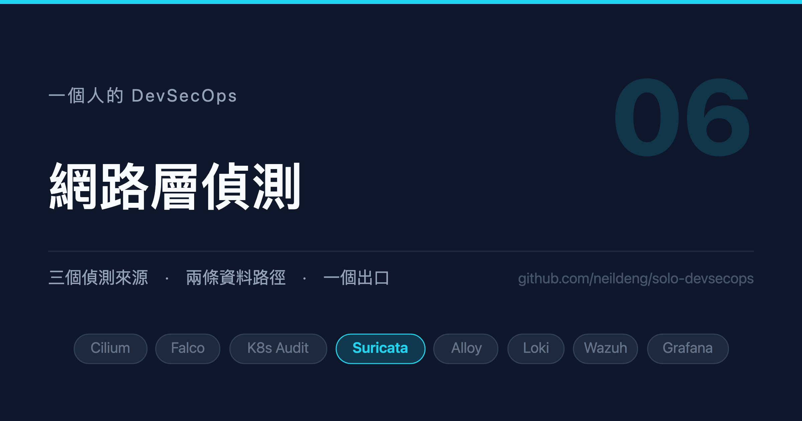

# 一個人的 DevSecOps (6)：網路層偵測



## 背景說明

三個偵測來源的最後一個：Suricata。它看的是**封包**——C2 回連、內網掃描、
橫向移動、L7 協定細節。這些是 Falco 與 K8s Audit 都看不到的。

本文會做三件事：

1. 設計一個把規則打進 image 的 Helm chart（而不是 ConfigMap）
2. 說明 Cilium 環境下 Suricata 的**視野限制**——這會決定你怎麼測
3. 示範「**先量再調**」：裝完先量組成，再決定要調什麼

第 3 點是本文的主軸。IDS 是最容易一裝上去就製造幾 GB 噪音的元件，而且
它的噪音會一路灌進 Loki、Wazuh 與索引。**在抱怨出現之前就先量，成本低得多。**

## 環境必須

1. 已完成第 3 篇（Loki / Alloy）
2. **至少三個節點**——理由見第 2 節
3. `docker`、`helm`、`yq`

## 1. 規則放 image，不放 ConfigMap

Suricata 的規則來自 `suricata-update`，啟用 ET Open 之後展開約 **53000 條、
十餘 MB**。ConfigMap 的上限是 1 MiB，放不下。

更重要的是：**image tag 本身就是一個可回滾的版本**。規則集更新是會出事的
操作（某條新規則可能讓你一夜之間多出幾萬筆告警），能用一個 tag 回到昨天
的狀態很有價值。

所以用兩階段建置：

```dockerfile
# Stage 1：以與 DaemonSet 相同版本的 Suricata 產生規則並驗證
FROM jasonish/suricata:8.0.6 AS build

COPY update.yaml enable.conf disable.conf modify.conf /etc/suricata/
COPY rules/local.rules /etc/suricata/rules/local.rules
COPY sources.txt /tmp/sources.txt

# 未指定 --no-test，suricata-update 會以 suricata -T 驗證；規則有誤就讓建置失敗
RUN suricata-update update-sources \
    && grep -Ev '^\s*(#|$)' /tmp/sources.txt | xargs -r -n1 suricata-update enable-source \
    && suricata-update --config /etc/suricata/update.yaml --no-reload --fail \
    && suricata-update list-enabled-sources

# Stage 2：只保留產出的規則
FROM alpine:3.22
COPY --from=build /var/lib/suricata/rules/ /rules/
```

DaemonSet 用一個 initContainer 把 `/rules` 複製到 emptyDir，主容器唯讀掛載。

### 建置階段的驗證抓不到所有問題

Stage 1 的 `suricata -T` 用的是 **image 的預設 `suricata.yaml`**，而
DaemonSet 跑的是 chart 渲染出來的設定。兩者的差異會讓規則載入失敗：
ET Open 會引用 `$HTTP_SERVERS`、`$SQL_SERVERS` 這類變數，chart 的設定
少宣告一個，對應的規則就整批載不進去。

所以另外寫一支腳本，**用 chart 實際渲染的設定再驗一次**：

```bash
#!/usr/bin/env bash
set -euo pipefail

CHART_DIR="$(cd "$(dirname "$0")" && pwd)"
SURICATA_IMAGE="$(yq '.image.repository + ":" + .image.tag' "$CHART_DIR/values.yaml")"
RULES_TAG="${1:-$(yq '.rules.image.tag' "$CHART_DIR/values.yaml")}"

WORK="$(mktemp -d)"

# 關鍵：用 helm template 取出真正會用的 suricata.yaml
helm template suricata "$CHART_DIR" --show-only templates/configmap.yaml \
    | yq '.data."suricata.yaml"' > "$WORK/suricata.yaml"

docker create --name validate-rules "$RULES_REPO:$RULES_TAG" >/dev/null
docker cp "validate-rules:/rules" "$WORK/rules"

docker run --rm \
    -v "$WORK/suricata.yaml:/etc/suricata/suricata.yaml:ro" \
    -v "$WORK/rules:/var/lib/suricata/rules:ro" \
    --entrypoint suricata "$SURICATA_IMAGE" \
    -T -c /etc/suricata/suricata.yaml -l /tmp > "$WORK/test.log" 2>&1 || true

grep -E 'rules successfully loaded' "$WORK/test.log"
```

畫面會輸出：

```
1 rule files processed. 53050 rules successfully loaded, 0 rules failed, 0 rules skipped
Validation passed.
```

`0 rules failed` 才算通過。

## 2. 視野限制：先知道你看不到什麼

這一節如果跳過，後面會浪費你好幾個小時。

> **Cilium native routing 下，同節點的 Pod 互連不經過 `eth0`。**

Suricata 以 AF_PACKET 掛在 `eth0` 上，所以它看得到：

- ✅ 跨節點的 Pod 互連
- ✅ 進出叢集的流量
- ❌ **同節點的 Pod 互連**

測規則時如果來源與目的碰巧在同一個節點，你會得到「規則沒問題但一筆都沒
觸發」的假象，然後開始懷疑規則、懷疑設定、懷疑 AF_PACKET ——而真正的問題
是封包從來沒經過 Suricata。

**所以測試一定要跨節點：**

```shell
kubectl run icmp-probe --image=busybox:1.36 --restart=Never -n default \
  --overrides='{"spec":{"nodeName":"the-one-worker3"}}' \
  --command -- sh -c 'ping -c 5 192.168.247.9'   # ← worker2 的 node IP
```

這也回頭解釋了第 1 篇為什麼堅持開三個 worker。

## 3. 部署

```shell
# tag 以建置日期為版本，需與 values.yaml 的 rules.image.tag 一致
RULES_TAG=2026.10.08.1
docker build -t harbor.example.com/security/suricata-rules:$RULES_TAG \
  ./charts/suricata/suricata-rules

./charts/suricata/validate-rules.sh $RULES_TAG

kind load docker-image -n the-one harbor.example.com/security/suricata-rules:$RULES_TAG

helm upgrade --install suricata -n kube-security ./charts/suricata
```

確認規則有載入：

```shell
kubectl logs -n kube-security -l app.kubernetes.io/name=suricata -c suricata --tail=50 \
  | grep "rules successfully loaded"
```

畫面會輸出：

```
Info: detect: 1 rule files processed. 53037 rules successfully loaded, 0 rules failed, 0 rules skipped
Notice: threads: Threads created -> W: 10 FM: 1 FR: 1   Engine started.
```

到這裡它「會動」了。**但先別接到告警鏈。**

## 4. 先量，再調

裝完第一件事是量它產生了什麼，不是看它的告警。

```shell
kubectl exec -n kube-security ds/suricata -c suricata -- sh -c '
  wc -lc /var/log/suricata/eve.json
  grep -o "\"event_type\":\"[a-z_]*\"" /var/log/suricata/eve.json | sort | uniq -c | sort -rn
'
```

畫面會輸出（單節點、約 16 分鐘）：

```
   21147 13648539 /var/log/suricata/eve.json
   7932 "event_type":"flow"
   6986 "event_type":"dns"
   5942 "event_type":"http"
    158 "event_type":"alert"
    118 "event_type":"stats"
     11 "event_type":"tls"
```

再看那 158 筆 alert 是什麼：

```
     29 "signature":"SURICATA HTTP Response excessive header repetition"
     27 "signature":"K8s Suricata ICMP Test"
     19 "signature":"SURICATA STREAM ESTABLISHED packet out of window"
     17 "signature":"SURICATA HTTP Request unrecognized authorization method"
     16 "signature":"SURICATA STREAM Packet with invalid ack"
     ...
```

整理成一張表：

| 項目 | 數字 |
|---|---|
| eve.json | 21147 行 / 13.6 MB → **約 1.2 GB/天/node** |
| alert 佔比 | **0.75%** |
| 158 筆 alert 中的協定異常 | **111 筆（70%）** |
| ET Open 真實命中 | **0 筆** |

三個問題浮出來了，而且是三個不同層次的問題。

## 5. 問題一：flow 事件是重複資料

flow 佔 37.5%，是整份 eve.json 裡最大的一塊。但是——

> **Cilium Hubble 已經提供 flow 層級的可視性**（來源/目的 endpoint、
> verdict、L4）。

Suricata 的 flow 記錄是同一件事的第二份。保留 `http` / `dns` / `tls` /
`ssh`——那是 Hubble 給不了的 L7 細節，也是 Threat Hunting 的主要素材。

```yaml
suricata:
  eve:
    types:
      - alert
      - http
      - dns
      - tls
      - ssh
      - stats
      # 刻意不含 flow
```

這裡學到一條判斷原則：

> **決定一份資料該不該收，要看「生態系裡已經有誰在收同樣的東西」，
> 而不是只看「這份資料本身有沒有用」。**

## 6. 問題二：沒有人在輪替 eve.json

1.2 GB/天/node，寫在 hostPath 上，**沒有輪替**。

有趣的是，image 裡其實附了 `/etc/logrotate.d/suricata`：

```
/var/log/suricata/*.log /var/log/suricata/*.json {
    daily
    missingok
    rotate 3
    ...
}
```

但是**容器裡沒有 cron 去執行它**。設定存在、沒有人跑。
而且症狀是**節點磁碟滿，不是 Suricata 報錯**。

解法是一個 sidecar：

```yaml
        - name: logrotate
          image: "{{ .Values.image.repository }}:{{ .Values.image.tag }}"
          command:
            - /bin/sh
            - -c
            - |
              while true; do
                  logrotate -s /var/log/suricata/.logrotate.state \
                            /etc/logrotate-suricata/logrotate.conf || true
                  sleep {{ .Values.logs.rotate.intervalSeconds }}
              done
```

設定改成以**大小**為準，而不是 image 預設的 `daily` + `rotate 3`
（那在 1.2 GB/天的速率下是每節點 4.8 GB）：

```
/var/log/suricata/*.log /var/log/suricata/*.json {
    size 200M
    rotate 2
    missingok
    notifempty
    nocompress
    copytruncate
}
```

**為什麼用 `copytruncate` 而不是 rename + `suricatasc -c reopen-log-files`：**
Alloy 的 `loki.source.file` 對「檔案被截短」有明確處理（偵測到大小倒退就把
offset 歸零），rename 則可能讓它跟丟尾端。而且 copytruncate 不需要讓
sidecar 碰 Suricata 的控制 socket。

## 7. 問題三：70% 的 alert 是環境造成的

`SURICATA STREAM invalid ack` / `out of window` 這類協定異常佔了 111 筆。
它們**與攻擊無關**，兩個成因都是環境：

1. 第 2 節講的半邊可見——只看得到一半的流，序號當然對不上
2. veth 上的 GRO/LRO 會把封包重組後才交給 AF_PACKET，序號看起來跳號

治本的做法是在節點關掉 offload：

```shell
ethtool -K eth0 gro off lro off
```

但那是改節點而非改 chart 的事，而且會影響該節點所有流量的效能。在「只看得到
跨節點流量」的前提下，這組規則提供的資訊量趨近於零，所以直接用
`disable.conf` 關掉：

```
# ---- TCP 串流異常：在本叢集是結構性誤報，不是偵測訊號 ----
group:stream-events.rules

# ---- HTTP 協定異常：Kubernetes 的正常流量形狀 ----
# 2221034  unrecognized authorization method —— API server 的 Bearer token
# 2221036  excessive header repetition      —— 多值 header 的正常用法
# 2221013  request header invalid
2221013
2221034
2221036
```

重建 image 後確認：

```shell
docker run --rm --entrypoint sh harbor.example.com/security/suricata-rules:$RULES_TAG -c '
  echo "STREAM 啟用中: $(grep -c "^alert .*SURICATA STREAM" /rules/suricata.rules)"
  echo "STREAM 已停用: $(grep -c "^# alert .*SURICATA STREAM" /rules/suricata.rules)"
'
```

畫面會輸出：

```
STREAM 啟用中: 0
STREAM 已停用: 66
```

## 8. 煙霧測試規則自己長成了噪音來源

這一節是整篇最值得記的。

為了確認整條鏈是通的，我寫了一條最簡單的規則：

```
alert icmp any any -> any any (msg:"K8s Suricata ICMP Test"; sid:1000001; rev:3;)
```

看起來無害。它踩了兩次：

**第一次**：`any any` 會收到 IPv6 的 router solicitation / neighbor
discovery multicast。16 分鐘自己產生 27 筆。

於是收斂成 IPv4 echo request：

```
alert icmp $HOME_NET any -> $HOME_NET any (... itype:8; icode:0; ...)
```

**第二次**：節點之間本來就有背景 ICMP（control-plane → worker 的健康檢查），
實測**數分鐘 113 筆**。

第二次才是真正危險的。113 筆的量足以讓下游 Wazuh 的爆發規則
（同一特徵 60 秒 15 次）判定為「事件爆發」而送出 **level 13 通知**。

> **一條為了驗證管線而存在的規則，差點變成告警疲勞的源頭。**

補上 threshold：

```
alert icmp $HOME_NET any -> $HOME_NET any (msg:"K8s Suricata ICMP Test";
  itype:8; icode:0;
  threshold:type limit, track by_src, count 1, seconds 300;
  classtype:misc-activity;
  metadata:mitre_tactic_id TA0007, mitre_technique_id T1046;
  sid:1000001; rev:5;)
```

實測一次 ping 剛好產生一筆：

```
before=160
after=161
```

順帶補了 `classtype`——沒有它，eve.json 的 `alert.category` 是空字串，
下游分級時無從依據。**寫自訂規則很容易漏掉這個欄位。**

## 9. 另一個自我放大的迴圈

還有一條規則值得抄走。Alloy 以 snappy 壓縮推送日誌給 Loki，這會觸發
Suricata 內建的 `sid 2221033`（abnormal Content-Encoding）。而那筆 alert
又被 Alloy 收集回 Loki ——**自我放大迴圈**。

只放行這一段流量，其他 Content-Encoding 異常照常偵測：

```
pass http any any -> any any (msg:"K8s Allow Alloy log push to Loki";
  flow:established,to_server;
  http.method; content:"POST";
  http.uri; content:"/loki/api/v1/push"; startswith;
  http.user_agent; content:"Alloy/"; startswith;
  sid:1000002; rev:1;)
```

**在可觀測性系統裡部署 IDS 要特別小心這種迴圈**：IDS 的告警會被日誌系統
收走，而日誌系統的流量又被 IDS 看著。

## 10. 驗證

```shell
# 1) 規則載入
kubectl logs -n kube-security -l app.kubernetes.io/name=suricata -c suricata --tail=50 \
  | grep "rules successfully loaded"

# 2) 煙霧測試（務必跨節點）
kubectl exec -n kube-security ds/suricata -c suricata -- \
  sh -c 'grep -c "K8s Suricata ICMP Test" /var/log/suricata/eve.json'

# 3) 事件組成：alert 佔比應遠低於其他 event_type
kubectl exec -n kube-security ds/suricata -c suricata -- \
  sh -c 'grep -o "\"event_type\":\"[a-z_]*\"" /var/log/suricata/eve.json | sort | uniq -c | sort -rn'

# 4) 磁碟：logrotate sidecar 應把 eve.json 壓在設定的 size 以內
kubectl exec -n kube-security ds/suricata -c suricata -- ls -lh /var/log/suricata/
```

**`local.rules` 改動後必須重建 rules image 並換 tag。** DaemonSet 是從 image
的 `/rules` 複製規則，改檔案不重建等於沒改。

## 小結

- **規則進 image 不進 ConfigMap**：53000 條規則放不下 1 MiB，而且 image tag
  本身就是可回滾的版本。另外要用 chart 實際渲染的設定再驗一次——建置階段的
  `suricata -T` 用的是 image 預設設定，抓不到變數缺漏。
- **先知道看不到什麼**：Cilium native routing 下同節點 Pod 互連不經過 eth0。
  不知道這件事就會把「封包沒經過」誤判成「規則寫錯」。
- **裝完先量組成，不要先看告警**：alert 只佔 0.75%、其中 70% 是環境造成的、
  flow 是 Hubble 已有的重複資料、而且沒有人在輪替日誌——四個問題都是量出來的，
  不是抱怨出來的。
- **連煙霧測試規則都要設 threshold**：節點間的背景流量足以讓它觸發下游的
  爆發告警。驗證用的東西也會變成噪音來源。

下一篇把三個來源匯進 Wazuh，讓它決定什麼才叫「告警」。

<!-- series:start -->
系列文：

- [一個人的 DevSecOps (1)：先畫地圖，再動手](01-overview.md)
- [一個人的 DevSecOps (2)：零信任的地基](02-zero-trust-network.md)
- [一個人的 DevSecOps (3)：看得見才管得住](03-observability.md)
- [一個人的 DevSecOps (4)：主機層偵測](04-falco-operator.md)
- [一個人的 DevSecOps (5)：控制平面偵測](05-k8s-audit.md)
- **一個人的 DevSecOps (6)：網路層偵測（本篇）**
- [一個人的 DevSecOps (7)：從事件到告警](07-wazuh-brain.md)
- [一個人的 DevSecOps (8)：最後一哩與告警疲勞](08-alerting-and-fatigue.md)
<!-- series:end -->

想要知道更多，可參考以下資源：

- [Suricata User Guide](https://docs.suricata.io/)
- [suricata-update](https://docs.suricata.io/en/latest/rule-management/suricata-update.html)
- [Emerging Threats Open Ruleset](https://rules.emergingthreats.net/)
- [Suricata EVE JSON Output](https://docs.suricata.io/en/latest/output/eve/eve-json-output.html)
