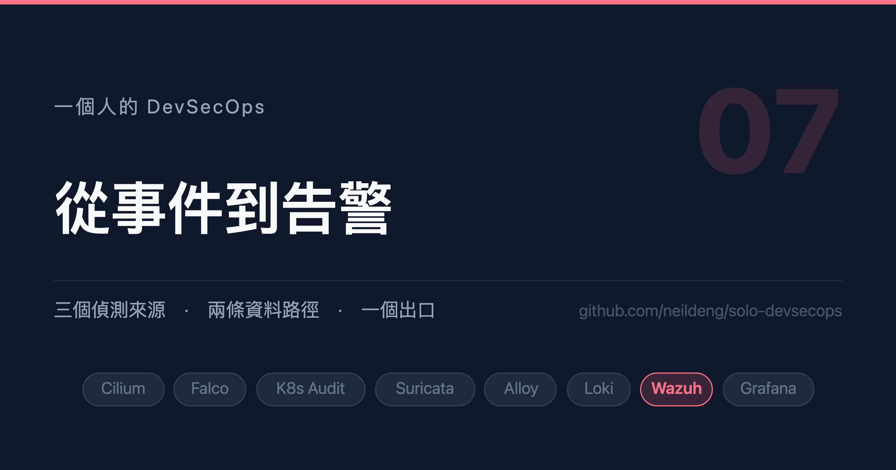

# 一個人的 DevSecOps (7)：從事件到告警

「告警大腦」的腦在規則層，不在輸出通道。同一次攻擊：逐筆 133 則，收斂後 1 則。



## 背景說明

到這裡三個偵測來源都有了，而且都在往 Loki 送。看起來很完整，但有一個根本
的問題還沒解決：

> **「事件」不是「告警」。**

Falco 每分鐘產生上百筆事件，Suricata 的 eve.json 一天 1.2 GB。如果把這些
直接接到聊天室，得到的不是一個 SOC，是一個沒有人會看的頻道。

中間缺的是一個**判斷層**：誰負責說「這一批事件合起來是一件值得你知道的事」。
本系列用 Wazuh 來做這件事。

本文的主軸是：**「告警大腦」的腦在規則層，不在輸出通道。** 我一開始把這兩件
事混在一起，差點走上一條代價很高的路。

## 環境必須

1. 已完成第 4、5、6 篇（三個偵測來源）
2. 叢集至少還有 **1150m CPU / 2.6 GiB** 的餘裕（見第 1 篇的資源盤算）

## 1. 縮編版 Wazuh

chart 預設要 3700m CPU / 5.2 GiB，單機 kind 吃不下。縮編：

```yaml
indexer:
  replicas: 1
  resources:
    requests: { cpu: 200m, memory: 1Gi }
  persistence:
    size: 10Gi
  extraEnvs:
    - name: OPENSEARCH_JAVA_OPTS
      value: "-Xms768m -Xmx768m"

manager:
  worker:
    replicas: 1
  master:
    persistence:
      size: 10Gi

# 索引保留全量，但不另外存一份純文字檔
archives:
  enabled: false
```

```shell
helm upgrade --install wazuh -n kube-security \
  --repo https://morgoved.github.io/wazuh-helm wazuh --version 2.0.7 \
  -f ./values/wazuh.yaml
```

## 2. 用 syslog，不用 agent

Wazuh 的標準做法是在每個節點裝 agent。但本系列已經有一個蒐集層了（Alloy），
再裝一個 agent 等於兩套蒐集邏輯、兩份 positions、兩個要維護的東西。

所以走 syslog：**Alloy 把事件以 RFC3164 syslog 送進 Wazuh manager 的 514。**

```
Falco / Suricata ──→ Alloy ──→ syslog(514) ──→ Wazuh worker
```

### 第一個坑：必須是 RFC3164，不能是 RFC5424

實測的差異：

| 協定 | Wazuh 的 predecoder 看到什麼 |
|---|---|
| RFC5424 | 只剝掉 `<134>`，表頭 `1 ... alloy falco - - -` 留在訊息裡，decoder 無從掛載，事件掉進兜底規則 1002 |
| RFC3164 | 正確取出 `program_name` / `hostname` / `timestamp` |

### 第二個坑：syslog exporter 從屬性組訊息，不會用 OTel 的 Body

這一行少了不會報錯，Wazuh 也完全收不到：

```river
otelcol.processor.transform "falco_syslog" {
  error_mode = "ignore"
  log_statements {
    context    = "log"
    statements = [
      // appname → Wazuh 的 program_name，decoder 靠它掛載
      `set(attributes["appname"], "falco")`,
      `set(attributes["hostname"], "alloy")`,
      // 少了這行不會報錯，Wazuh 也完全收不到
      `set(attributes["message"], body)`,
    ]
  }
  output { logs = [otelcol.exporter.syslog.wazuh.input] }
}

otelcol.exporter.syslog "wazuh" {
  // 只能是 worker：syslog 的 <remote> 區塊只在 worker.conf
  endpoint = "wazuh-manager-worker.kube-security.svc.cluster.local"
  port     = 514
  network  = "tcp"
  protocol = "rfc3164"
  tls { insecure = true }
}
```

### 第三個坑：容器日誌是 CRI 格式，不是純 JSON

磁碟上的 Falco 日誌長這樣：

```
2026-10-07T00:51:19Z stdout F {"hostname":...}
```

前面那一段不剝掉的話，Wazuh 的 `JSON_Decoder` 解不出欄位：

```river
loki.process "falco_cri" {
  stage.cri {}
  forward_to = [otelcol.receiver.loki.falco_bridge.receiver]
}
```

## 3. 分流原則：Loki 收全量，Wazuh 收需要判斷的

Suricata 那條管線示範了這個原則。**只送 `event_type: alert`：**

```river
loki.process "suricata_alerts" {
  // 第一關：濾掉 fast.log 與 audit log
  stage.match {
    selector = `{component!="eve"}`
    action   = "drop"
  }

  stage.json { expressions = { event_type = "event_type" } }

  // 第二關：只留 alert。stage.drop 是「命中就丟」，沒有反向的 keep，
  // 所以列舉要丟的種類
  stage.drop {
    source              = "event_type"
    expression          = "^(http|dns|tls|ssh|flow|stats|fileinfo|anomaly)$"
    drop_counter_reason = "suricata_not_alert"
  }

  forward_to = [otelcol.receiver.loki.suricata_bridge.receiver]
}
```

三個東西各自有不送的理由：

| 不送 | 理由 |
|---|---|
| `fast.log` | 與 eve.json 的 alert 是同一批事件的兩種格式，送兩次等於每個告警出現兩次 |
| audit log | 已由 Falco 的 k8saudit plugin 覆蓋 |
| 其他 event_type | 是脈絡不是告警。實測 alert 只佔 0.75%，整份送進去等於要 Wazuh 為 **133 倍**的資料量做規則比對 |

## 4. decoder 與分級

Wazuh 的規則掛在 decoder 上，而 decoder 靠 `program_name` 掛載：

```xml
<decoder name="falco">
    <program_name>^falco$</program_name>
</decoder>

<decoder name="falco-json">
    <parent>falco</parent>
    <plugin_decoder>JSON_Decoder</plugin_decoder>
</decoder>
```

規則分成兩層：**level 0 只分類不告警，上面再疊分級規則。**

```xml
<!-- level 0：只負責解碼與分類，避免每筆事件都是噪音 -->
<rule id="100100" level="0">
  <decoded_as>falco</decoded_as>
  <description>Falco: 事件已解碼</description>
</rule>

<rule id="100110" level="12">
  <if_sid>100100</if_sid>
  <field name="priority">^Critical$</field>
  <description>Falco Critical: $(rule)</description>
  <mitre><id>T1562.001</id></mitre>
</rule>
```

### 內建支援不等於可用支援

Suricata 的部分有個意外。Wazuh **內建**了 `0475-suricata_rules.xml`，看到的
當下覺得省事。打開來看：

```xml
<rule id="86601" level="3">
  <if_sid>86600</if_sid>
  <field name="event_type">^alert$</field>
  <description>Suricata: Alert - $(alert.signature)</description>
</rule>
```

**每一筆 Suricata alert 一律 level 3，不分 severity 也不分 category。**
在「level ≥ 13 才通知」的架構下，這等於 Suricata 永遠不會告警——53000 條
ET Open 規則，從 ICMP 測試到 CVE 利用嘗試，全部同一個等級。

所以自己寫一組。意外的好處是不會衝突：經 syslog 進來的事件會先掛上
`program_name` 的 decoder，不是裸 json，所以內建的 86600
（`decoded_as json`）本來就不會觸發。

```xml
<decoder name="suricata-syslog">
    <program_name>^suricata$</program_name>
</decoder>
<decoder name="suricata-syslog-json">
    <parent>suricata-syslog</parent>
    <plugin_decoder>JSON_Decoder</plugin_decoder>
</decoder>
```

```xml
<rule id="100201" level="3">
  <if_sid>100200</if_sid>
  <field name="event_type">^alert$</field>
  <description>Suricata: $(alert.signature) [$(src_ip) -> $(dest_ip)]</description>
</rule>

<!-- 以 classtype 分級優先於 severity -->
<rule id="100202" level="12">
  <if_sid>100201</if_sid>
  <field name="alert.category">Privilege Gain|Trojan|Malware|Exploit|Shellcode|Web Application Attack|Command and Control</field>
  <description>Suricata 高危特徵: $(alert.signature)</description>
  <mitre><id>T1071</id></mitre>
</rule>

<rule id="100203" level="12">
  <if_sid>100201</if_sid>
  <field name="alert.severity">^1$</field>
  <description>Suricata 高優先級: $(alert.signature)</description>
</rule>
```

**為什麼 classtype 優先於 severity**：ET Open 的 severity 是由 classtype
推導出來的，但自訂規則常常漏寫 `priority` 而一律落在 3（第 6 篇我自己的
`sid 1000001` 就是），classtype 則是寫規則時幾乎一定會填的欄位。

## 5. 核心：爆發收斂

這才是「Wazuh 當告警大腦」真正的意思。

> **索引保留全量供獵捕，通知只給「事件」而不是「每一筆紀錄」。**

level 12 的規則維持不變、繼續進索引，但**不該是通知的對象**——一次攻擊會
產生幾十上百筆，逐筆通知就是告警疲勞的來源。

```xml
<!-- 同一條規則短時間內重複：收斂成一則 -->
<rule id="100130" level="13" frequency="8" timeframe="60" ignore="300">
  <if_matched_sid>100110</if_matched_sid>
  <same_field>data.rule</same_field>
  <description>Falco 事件爆發: $(data.rule) 於 60 秒內觸發 8 次以上</description>
</rule>

<!-- audit 事件的頻率天然低於 syscall，門檻要跟著調低，
     否則永遠達不到而形同虛設 -->
<rule id="100131" level="13" frequency="5" timeframe="120" ignore="300">
  <if_matched_sid>100125</if_matched_sid>
  <same_field>data.rule</same_field>
</rule>

<!-- 跨規則的關聯：短時間內出現多種不同的 Critical，
     那像是一連串的攻擊步驟而非單點雜訊。刻意不加 same_field -->
<rule id="100132" level="14" frequency="12" timeframe="120" ignore="600">
  <if_matched_sid>100110</if_matched_sid>
  <description>Falco 多重 Critical: 120 秒內累計 12 次以上，疑似攻擊進行中</description>
</rule>
```

三個參數各有意義：

| 參數 | 意義 |
|---|---|
| `frequency` + `timeframe` | 幾次/幾秒算爆發 |
| `ignore` | 抑制期，同一條規則在這段時間內只通知一次 |
| `same_field` | 要「同一條規則重複」還是「不同規則一起出現」 |

Suricata 那組門檻要更高——網路事件天生比主機事件密集：

```xml
<rule id="100210" level="13" frequency="15" timeframe="60" ignore="300">
  <if_matched_sid>100201</if_matched_sid>
  <same_field>data.alert.signature</same_field>
</rule>

<!-- 這條是 Suricata 最獨特的價值：同一來源短時間內大量 alert，
     形狀就是掃描或橫向移動。Falco 看不到這件事——
     對它而言那只是某個行程開了幾個 socket -->
<rule id="100212" level="13" frequency="25" timeframe="60" ignore="600">
  <if_matched_sid>100201</if_matched_sid>
  <same_field>data.src_ip</same_field>
  <description>Suricata: 單一來源 $(src_ip) 於 60 秒內觸發 25 次以上，疑似掃描或橫向移動</description>
  <mitre><id>T1046</id></mitre>
</rule>
```

### 收斂的效果

實測：一個特權 Pod，兩分鐘內。

| 路徑 | 送出則數 |
|---|---|
| 逐筆（falcosidekick 直送） | **133** |
| Wazuh 爆發收斂（100132） | **1** |

**133:1。** 而且索引裡那 133 筆一筆都沒少，隨時可以查。

## 6. MITRE 對應與 mitre.db 的陷阱

Wazuh 可以在規則上掛 ATT&CK 編號：

```xml
  <mitre>
    <id>T1562.001</id>
  </mitre>
```

**但編號必須存在於 Wazuh 內建的 `mitre.db`。** 那是一個約 2023-05 的
ATT&CK 快照（4.14.3 實測 `max(modified_time) = 2023-05-04`）。

查詢時注意 `technique.id` 是 STIX UUID，ATT&CK 編號在 `reference.external_id`：

```sql
SELECT r.external_id, t.name FROM reference r
JOIN technique t ON t.id = r.id WHERE r.external_id = 'T1562.001';
```

未知編號的行為是**靜默降級**：

```
** WARNING: Mitre Technique ID 'T1685' not found in database.
```

規則照樣載入、照樣觸發 level 12 告警，只是 `mitre.id` / `mitre.tactic` /
`mitre.technique` 三個欄位**整組消失**。告警還在所以表面正常，但 ATT&CK
對應沒了——這比直接報錯難發現得多。

> **寫 Wazuh 規則前先查 mitre.db 確認編號存在。** 新編號要嘛自行更新 db，
> 要嘛沿用仍在 db 裡的舊編號。

## 7. 三個會讓你懷疑人生的運維陷阱

### 一、自訂規則只能放 master

Wazuh 叢集會把 master 的 ruleset 同步覆寫到 worker。直接改 worker 容器內的
`/var/ossec/etc/{decoders,rules}/` 會在數十秒後被還原，而症狀是
「decoder 匹配不到」，**沒有任何錯誤訊息**。

正式入口是 values 的 `localDecoder` / `localRules`。

### 二、檔案同步到 worker ≠ 執行中的 analysisd 重新載入

這一個花掉我最多時間，而且它騙過了我所有的檢查。

症狀：

```
wazuh-logtest 餵同一行 → 命中 100201，完全正確
真實事件走完整管線     → Wazuh 一筆告警都沒有
```

中間每一站都證明是通的：Alloy 的丟棄計數器在動、transform 的 in/out 都是 63、
syslog exporter 的 `send_failed` 是 0、Wazuh 的 `discarded_count` 是 0，
而且**同一條 TCP 連線上的 Falco 事件正常抵達**。

我甚至 grep 過 worker 上的 `local_decoder.xml`，看到新 decoder 已經在了。
於是排除了「規則沒同步」這個可能。

**錯就錯在這裡。**

> 檔案同步到 worker 是檔案層的事。**跑著的 analysisd 仍抱著舊的規則集。**

而且 ConfigMap 是 subPath 掛載，kubelet 根本不會更新它。所以改完 values 要：

```shell
kubectl rollout restart sts/wazuh-manager-master sts/wazuh-manager-worker -n kube-security
```

**驗證要看行為（alerts.json 有沒有出現新規則 id），不要只 grep 檔案。**

### 三、level 0 的分類規則會吞掉告警

第 5 篇講過，這裡再提一次因為它值得：加分類規則時，要同時確認「高等級的
還走得出去」。而且如果另一條路徑的告警照常流動，你**完全看不出有缺口**。

## 8. 驗證

不要只驗一段，要從頭驗到尾。

```shell
# 1) decoder 與規則：用 wazuh-logtest 餵一筆真實的事件
printf 'Oct  8 01:04:29 alloy suricata: %s\n' "$(cat sample-alert.json)" \
  | kubectl exec -i -n kube-security wazuh-manager-worker-0 -c wazuh-manager -- \
      /var/ossec/bin/wazuh-logtest
```

畫面會輸出：

```
**Phase 2: Completed decoding.
	name: 'suricata-syslog'
	alert.category: 'Misc activity'
	alert.signature: 'K8s Suricata ICMP Test'
	src_ip: '10.0.1.5'

**Phase 3: Completed filtering (rules).
	id: '100201'
	level: '3'
	description: 'Suricata: K8s Suricata ICMP Test [10.0.1.5 -> 192.168.247.9]'
**Alert to be generated.
```

```shell
# 2) 真實流量端到端：產生跨節點 ICMP，看 alerts.json
kubectl exec -n kube-security wazuh-manager-worker-0 -c wazuh-manager -- \
  sh -c 'grep -o "\"id\":\"1002[0-9][0-9]\"" /var/ossec/logs/alerts/alerts.json | sort | uniq -c'
```

畫面會輸出：

```
    113 "id":"100201"
      2 "id":"100202"
      1 "id":"100203"
      1 "id":"100211"
```

**第 1 步過了但第 2 步沒過，就是上一節的「analysisd 沒重載」。**
這兩步各自驗的是不同的東西：規則對不對，以及規則有沒有真的在跑。

## 小結

- **「告警大腦」的腦在規則層，不在輸出通道**：要的是「判斷在 Wazuh」，
  不是「封包從 Wazuh 出去」。搞清楚這件事可以省下很多力氣。
- **索引收全量，通知給事件**：level 12 進索引供獵捕、level 13 以上才通知。
  實測逐筆 133 則 vs 收斂後 1 則，而且那 133 筆一筆都沒少。
- **內建支援要再問一句支援到什麼程度**：Wazuh 內建的 Suricata 規則把 53000
  條規則打成同一個 level 3，在分級架構下等於沒有支援。
- **檔案同步 ≠ 規則生效**：grep 到新內容不代表 analysisd 載入了。驗證要看
  行為不要看檔案。這是本系列第三次出現「靜態證據不能證明動態行為」。

下一篇是最後一哩：把告警送出去，以及如何不讓它變成一個被靜音的頻道。

<!-- series:start -->
系列文：

- [一個人的 DevSecOps (1)：先畫地圖，再動手](01-overview.md)
- [一個人的 DevSecOps (2)：零信任的地基](02-zero-trust-network.md)
- [一個人的 DevSecOps (3)：看得見才管得住](03-observability.md)
- [一個人的 DevSecOps (4)：主機層偵測](04-falco-operator.md)
- [一個人的 DevSecOps (5)：控制平面偵測](05-k8s-audit.md)
- [一個人的 DevSecOps (6)：網路層偵測](06-suricata.md)
- **一個人的 DevSecOps (7)：從事件到告警（本篇）**
- [一個人的 DevSecOps (8)：最後一哩與告警疲勞](08-alerting-and-fatigue.md)
<!-- series:end -->

想要知道更多，可參考以下資源：

- [Wazuh Ruleset](https://documentation.wazuh.com/current/user-manual/ruleset/)
- [Wazuh Custom Rules](https://documentation.wazuh.com/current/user-manual/ruleset/custom.html)
- [Wazuh MITRE ATT&CK](https://documentation.wazuh.com/current/user-manual/ruleset/mitre.html)
- [OpenTelemetry Syslog Exporter](https://github.com/open-telemetry/opentelemetry-collector-contrib/tree/main/exporter/syslogexporter)
